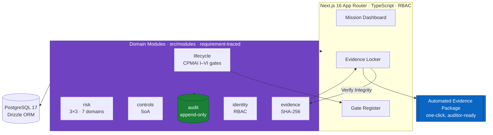

# Priora

[](https://github.com/jdavis-cyber/priora/actions/workflows/ci.yml)
[](https://priora-gules.vercel.app)
[](#why-it-exists)
[](#architecture)

> **Priora** (pree-OR-uh, Latin: *"the things that come before"*) — an AI
> lifecycle governance platform operationalizing
> *The Decisions That Come Before Scale: An AI Lifecycle Playbook for
> Regulated Environments*.

> ### For hiring managers — what this demonstrates
> Priora is a full-stack, shipped **AI governance platform** that turns CPMAI lifecycle gates, risk/control registers, and hash-verified evidence into a single system of record — with **one-click auditor evidence packages**. It's proof I can do the whole arc: **build the systems, govern the systems, and defend the evidence.** The repo itself practices the phase-gate discipline the product enforces (signed commits, protected `main`, CI-gated merges, ADRs, requirement-traced TDD).
>
> **Bridges:** AI lifecycle governance · ISO/IEC 42001 + NIST AI RMF + CPMAI · security/compliance/audit · hands-on full-stack GenAI engineering · governance-as-code.
> **Try it:** [live demo](https://priora-gules.vercel.app) (logins below) · **More:** [secondorderstrategy.com](https://secondorderstrategy.com) · author: Jerome Davis

Priora is a single system of record for AI governance: every AI project's
position in the CPMAI lifecycle (Phases I–VI, tri-state phase gates), living
risk and control registers, hash-verified evidence, and one-click
**Automated Evidence Package (AEP)** generation for auditors.

**Status:** v1 shipped — live demo below. M0–M6 complete.

## By the numbers

| Signal | Value |
| --- | --- |
| Shipped scope | **v1 (M1–M6) complete** · live hosted demo |
| Codebase | **~8,300 LOC** across **107 TypeScript files** |
| Domain modules | **7** requirement-traced: lifecycle, risk, controls, evidence, identity, audit, dashboard |
| Test coverage | **129 test cases** across **32 unit + 6 e2e** specs (TDD, requirement-named) |
| Evidence integrity | **SHA-256** hashed, one-click **AEP** export |
| Engineering rigor | **3 ADRs**, RTM, signed commits, protected `main`, CI-gated merges |


## Live demo

**URL:** <https://priora-gules.vercel.app>  ·  Data resets daily at 09:00 UTC. All content is fictional.

| Role | Login | Password |
|---|---|---|
| Governance Lead | `avery.cole@priora.demo` | `demo-priora-2026` |
| Executive Sponsor | `morgan.reyes@priora.demo` | `demo-priora-2026` |
| Program Manager | `priya.natarajan@priora.demo` | `demo-priora-2026` |
| ML Engineer | `felix.okafor@priora.demo` | `demo-priora-2026` |
| Risk Officer | `dana.whitfield@priora.demo` | `demo-priora-2026` |
| Auditor (read-only) | `sam.aldous@priora.demo` | `demo-priora-2026` |

Suggested tour: log in as **Governance Lead** → Mission Dashboard → open a
project → Gate Register → Evidence Locker → "Verify Integrity" → generate an
AEP. Then log in as **Auditor** and confirm everything is visible but nothing
is editable.

## Why it exists

Most organizations govern AI with static policies, spreadsheets, and
after-the-fact reviews. Priora makes governance an execution layer:
decisions are recorded where they happen, evidence is born traceable, and
audit readiness is a button, not a quarter.

## Architecture



Modular monolith — Next.js 16 (App Router) + TypeScript, PostgreSQL +
Drizzle. Domain logic lives in `src/modules/*` as framework-independent,
requirement-traced functions. See [ADR-0001](docs/adr/0001-modular-monolith-supersedes-legacy-architectures.md)
and [ADR-0002](docs/adr/0002-technology-stack.md).

## Engineering standards

- **TDD with requirement-named tests** — [docs/rtm.md](docs/rtm.md) traces
  requirement → module → test
- **Signed commits, protected main, CI-gated merges** — the repo practices
  the phase-gate discipline the product enforces
- **ADRs for every load-bearing decision** — [docs/adr/](docs/adr/)
- **Schema drift check** — migrations are mandatory, reviewed SQL

## Roadmap

| Phase | Scope |
|---|---|
| **v1 (M1–M6)** | Decision/evidence layer: lifecycle engine + gates, risk register (3×3, 7 domains), SoA, evidence locker (SHA-256), AEP generator, mission dashboard, RBAC + append-only audit log, hosted demo |
| **v2** | MRP wizard, risk-acceptance workflow, reciprocity & inheritance register, governance cadence calendar, material change evaluation, maturity scoring |
| **v3 (tracking DoD CSRMC as it matures)** | Continuous Compliance Validation (CCV) engine, Automated Control Validation Ruleset (ACVR), telemetry ingestion, incident ticketing, supplier & competency management |

## Run it locally

```bash
cp .env.example .env
docker compose up -d        # Postgres 17
npm ci
npm run db:migrate
npm run dev
```

`npm test` · `npm run typecheck` · `npm run lint` · `npm run db:check`

To run the demo profile locally: `APP_PROFILE=demo npm run dev` (banner on, user
management disabled). Seed it first: `npm run seed -- --profile demo`.

## About the author

Built by **Jerome Davis** — a governance operator bridging DoD/federal program execution, security/compliance/audit, ISO 42001/27001 + NIST AI RMF, and hands-on GenAI engineering. Priora is part of a portfolio demonstrating governance-as-code end to end.

🔗 **[secondorderstrategy.com](https://secondorderstrategy.com)** · companion projects: [Lliam-GOV](https://github.com/jdavis-cyber/lliam-gov) (governed AI agent) · [DoW AI PM Builder Template](https://github.com/jdavis-cyber/dow-ai-pm-builder-template) (governed AI software factory)
